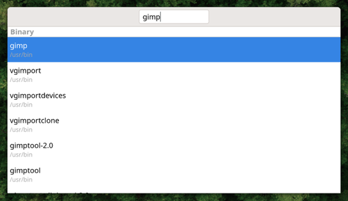

# SearchTool GTK

This is a generic GTK search tool and launcher. It runs as a background server and is activated via D-Bus as well as several client wrappers.

## Table of contents

* [Usage](#usage)
* [Installation](#installation)
* [Configuration](#motivation)
* [Motivation](#motivation)

## Usage

This tool is flexible enough to support a wide variety of use cases. It is configured via a list of "Modes" ([`SearchToolMode`](./src/searchtool_gtk/modes/base.py)), where the mode determines, with the help of collators ([`SearchToolCollator`](./src/searchtool_gtk/collation/base.py)), what items to show, how to filter the items and how to activate them. The list of items is fetched whenever the mode is activated, the list is only repopulated if the item list has changed.

Each mode is determined by a name and a fully qualified Python class name, so creating a custom mode does not require any changes to the tool itself. The following mode classes are part of the tool:

* [`BinMode`](./src/searchtool_gtk/modes/bin.py): Lists all binaries in `PATH`.
* [`FileMode`](./src/searchtool_gtk/modes/file.py): Accepts a list of glob patterns, lists all the matching files and activates a file via `xdg-open`.
* [`PipeMode`](./src/searchtool_gtk/modes/pipe.py): Allows manually specifying the options; `bin/searchtool-gtk-dmenu` provides a dmenu-like interface via this mode (see below).
* [`ClipHistMode`](./src/searchtool_gtk/modes/cliphist.py): A mode specifically adapted for [ClipHist](https://github.com/sentriz/cliphist).

Launching the tool is done by simply running `searchtool-gtk-server`.

Given the [default configuration](./default_config.toml), we can launch the "binary" mode as follows:

    searchtool-gtk-activate binary

The `dmenu` tool can be used as follows (after configuring a `ClipHistMode` mode named "clipboard"):

    cliphist list | searchtool-gtk-dmenu clipboard | cliphist decode | wl-copy --type text/plain

> [!NOTE]
> wl-copy tries to detect the MIME type of its input by default, so, without the `--type` option, copying can lead to unexpected behavior.

Once the popup is launched, usage is obvious:

* `Escape` clears any input and hides the popup.
* `Enter` launches the currently selected item.
* `Up/Down` keys, as well as the mouse, allow selecting items.
* Typing simply filters the search results.

The mode for files (and binaries) uses GTK's recent file history to sort files by their latest usage date.

## Installation

An easy way to install the three executables (`searchtool-gtk-{server,activate,dmenu}`) for the current user is via [`pipx`](https://pipx.pypa.io):

    pipx install git+https://github.com/v--/searchtool-gtk

An alternative is to use [`uv`](https://docs.astral.sh/uv/):

    uv tool install searchtool-gtk --from git+https://github.com/v--/searchtool-gtk

The hard prerequisites are a supported version of Python and GTK4.

For performance reasons, the package also provides native counterparts to the Python scripts `searchtook-gtk-activate` and `searchtook-gtk-dmenu`. Using them requires cloning the repository and building from source:

    make build-c
    install -D -m755 dist/searchtool-gtk-activate "$dest/searchtool-gtk-activate"
    install -D -m755 dist/searchtool-gtk-dmenu "$dest/searchtool-gtk-dmenu"

> [!TIP]
> An [AUR package](https://aur.archlinux.org/packages/searchtool-gtk) is available for reference. If you are packaging this for some other package manager, consider using PEP-517 tools as shown in [this PKGBUILD file](https://aur.archlinux.org/cgit/aur.git/tree/PKGBUILD?h=searchtool-gtk).

## Configuration

We use the [XDG config directories](https://specifications.freedesktop.org/basedir-spec/basedir-spec-latest.html) (the defaults should be `/etc/xdg` or `~/.config`) to search for a directory `searchtool` with a configuration file named `config.toml`. The format should be clear from [`default_config.toml`](./default_config.toml).

## Motivation

Similar tools often rely on clunky indexing services or have noticeable startup slowdowns. I decided to implement a simple yet efficient solution - an application that is relatively heavyweight when compared to `dmenu`, but instantaneous to start due to it being run as a hidden window. It is more related to the `dmenu` category of tools rather than GNOME or KDE launchers because it is based on plain text items.
