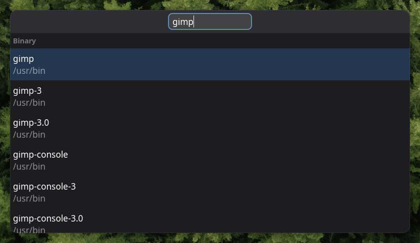

# SearchTool GTK

[](https://aur.archlinux.org/packages/searchtool-gtk)

This is a generic GTK search tool and launcher. It runs as a background server and is activated via D-Bus as well as several client wrappers.



## Motivation

Similar tools often rely on clunky indexing services or have noticeable startup slowdowns. I decided to implement a simple yet efficient solution - an application that is relatively heavyweight when compared to `dmenu`, but instantaneous to start due to it being run as a hidden window. It is more related to the `dmenu` category of tools rather than GNOME or KDE launchers because it is based on plain text items.

## Usage

This tool is flexible enough to support a wide variety of use cases. It is configured via a list of "Modes" ([`SearchToolMode`](./searchtool_gtk/modes/base.py)), where the mode determines, with the help of collators ([`SearchToolCollator`](./searchtool_gtk/collation/base.py)), what items to show, how to filter the items and how to activate them. The list of items is fetched whenever the mode is activated, the list is only repopulated if the item list has changed.

Each mode is determined by a name and a fully qualified Python class name, so creating a custom mode does not require any changes to the tool itself. The following mode classes are part of the tool:

* [`BinMode`](./searchtool_gtk/modes/bin.py): Lists all binaries in `PATH`.
* [`FileMode`](./searchtool_gtk/modes/file.py): Accepts a list of glob patterns, lists all the matching files and activates a file via `xdg-open`.
* [`PipeMode`](./searchtool_gtk/modes/pipe.py): Allows manually specifying the options; `bin/searchtool-gtk-dmenu` provides a dmenu-like interface via this mode (see below).
* [`ClipHistMode`](./searchtool_gtk/modes/cliphist.py): A mode specifically adapted for [ClipHist](https://github.com/sentriz/cliphist).

Launching the tool is done by simply launching `searchtool-gtk-server`.

Given the [default configuration]('./searchtool.json.default'), we can launch the "Binary" mode as follows:
```
searchtool-gtk-activate Binary
```

The `dmenu` tool can be used as follows (after configuring a `ClipHistMode` mode named "Clipboard"):
```
cliphist list | searchtool-gtk-dmenu Clipboard | cliphist decode | wl-copy
```

Once the popup is launched, usage is obvious:

* `Escape` clears any input and hides the popup.
* `Enter` launches the currently selected item.
* `Up/Down` keys, as well as the mouse, allow selecting items.
* Typing simply filters the search results.

The mode for files (and binaries) uses GTK's recent file history to sort files by their latest usage date.

## Installation

An [AUR package](https://aur.archlinux.org/packages/searchtool-gtk) is available.

The two hard prerequisites are a supported version of Python and GTK4, as well as a C compiler.

The following steps are sufficient:

* Make sure [`poetry`](https://python-poetry.org/) is installed.
* Clone the repository.

* Build and install the Python GUI:
    ```
    poetry install
    poetry build
    pipx install --include-deps dist/*.whl
    ```

    Note that `pipx` not only installs the Python module but also creates a `searchtool-gtk-server` executable.

* Build the binaries:
    ```
    make bin/searchtool-gtk-activate
    make bin/searchtool-gtk-dbus
    ```

    Do whatever you want with these two binaries.

If you are packaging this for some other package manager, consider using PEP-517 tools as shown in [this PKGBUILD file](https://aur.archlinux.org/cgit/aur.git/tree/PKGBUILD?h=searchtool-gtk).

## Configuration

We use the [XDG config directories](https://specifications.freedesktop.org/basedir-spec/basedir-spec-latest.html) (the defaults should be `/etc/xdg` or `~/.config`) to search for a user configuration file named `searchtool.json`. The format should be clear from [`./searchtool.json.default`](./searchtool.json.default), but one can view the schema in [`./searchtool_gtk/settings.py`](./searchtool_gtk/settings.py) just to be sure.

## Why mix Python and C?

Python is much easier to write and maintain. At the same time, the client binaries cannot be written in Python because of Python's startup slowdown.
